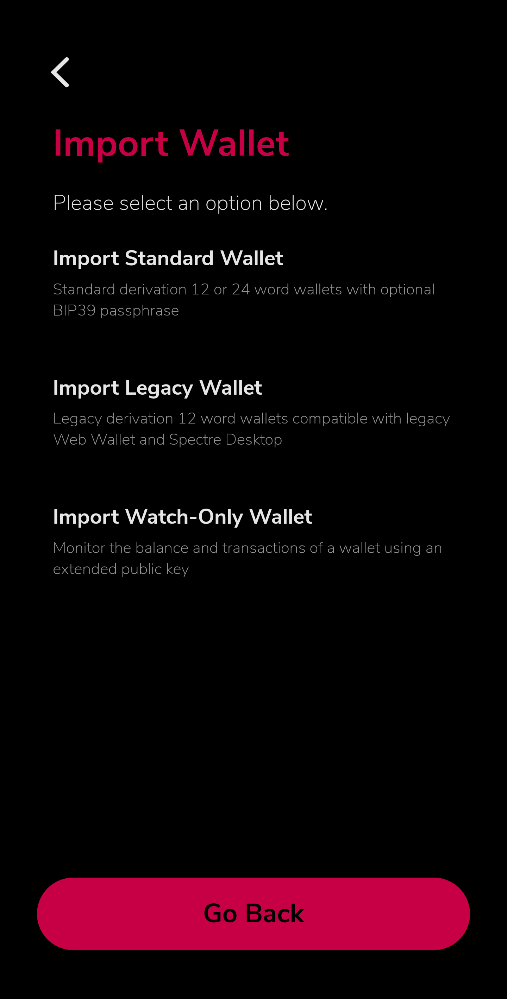
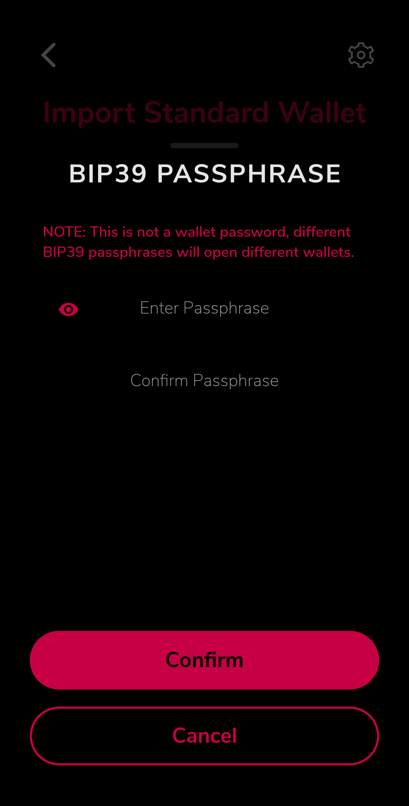

## What is Spectrum?

[](https://github.com/spectre-project/spectre-mobile/actions/workflows/ci.yml)
[](https://github.com/spectre-project/spectre-mobile/releases)
[](https://github.com/spectre-project/spectre-mobile/blob/main/LICENSE)
[](https://github.com/spectre-project/spectre-mobile/releases/latest)
[](https://discord.com/invite/FZPYpwszcF)

Spectrum is a non-custodial wallet for the [Spectre Network](https://spectre-network.org/)
BlockDAG, available for Android and iOS. It is written in
[Dart](https://dart.dev) using [Flutter](https://flutter.dev).

## Features

- **Wallet Import:** Import 12 and 24-word wallets, supporting all derivation paths, including [Spectre Desktop](https://github.com/spectre-project/spectre-desktop),
  [Webwallet](https://wallet.spectre-network.org/), [Rusty Spectre](https://github.com/spectre-project/rusty-spectre) and [Spectred (Golang)](https://github.com/spectre-project/spectred).
- **BIP39 Passphrase Support**: Supports BIP39 passphrases for enhanced wallet security.
- **Watch-Only Wallet Monitoring:** Securely monitor your wallet without importing your private key by using the `export mnemonic` command in [rusty-spectre](https://github.com/spectre-project/rusty-spectre). This prints the extended public key, which can be imported into the Spectre mobile wallet using the `Import Watch-Only Wallet` option. With the extended public key, you can gain read-only access to view incoming transactions and monitor your balance without being able to send funds.
- **Real-Time Network Stats:** Monitor network statistics directly from the network menu.
- **Mining Reward Calculator:** Access a mining reward calculator in the advanced menu.
- **CSV Export:** Export your transactions as CSV files from the advanced menu.
- **Theme Options:** Choose between Light, Dark, and AMOLED Dark themes.

## Contributing

- Fork the repository and clone it to your local machine
- Follow the instructions [here](https://flutter.io/docs/get-started/install) to install the Flutter SDK
- Setup [Android Studio](https://flutter.io/docs/development/tools/android-studio) or [Visual Studio Code](https://flutter.io/docs/development/tools/vs-code).

## Building

### Android:

To build the APK for Android, use the following command:

```bash
flutter build apk
```

This command compiles the app into a single universal APK compatible with all device architectures.

If you want to create a signed APK, you need to include the `--release` argument:

```bash
flutter build apk --release
```

Adding the `--release` argument will build the app in release mode, which triggers the signing process using the release signing configuration defined in your `build.gradle` file. This produces a signed APK ready for distribution.

For generating APKs for specific device architectures, use:

```bash
flutter build apk --split-per-abi
```

This will create separate APKs for different ABIs (Application Binary Interfaces), allowing users to download only the APK suitable for their device, reducing the overall download size.

### iOS:

To build the app for iOS, use:

```bash
flutter build ios
```

This command compiles the app for iOS devices.

### Running the App:

If you have a connected device or emulator, you can run the app directly from your development machine.

#### Debug Mode:

To run the app in debug mode, use:

```bash
flutter run
```

This mode is useful for development and testing, providing hot reload and detailed error messages.

#### Release Mode:

To run the app in release mode, use:

```bash
flutter run --release
```

## Regenerate gRPC Code

If you need to regenerate the protocol code after updates, please do the
following:

```bash
dart pub global activate protoc_plugin 21.1.2
protoc --dart_out="grpc:lib/spectre/grpc" -I./proto messages.proto p2p.proto rpc.proto --plugin ~/.pub-cache/bin/protoc-gen-dart
```

## Translations

For some details regarding translations, have a look at
[Translations and translators](./TRANSLATORS.md).

## Have a question?

If you need any help, feel free to [file a feature request or an issue](https://github.com/spectre-project/spectre-mobile/issues) if you do not manage to find a solution.

## Screenshots

|  |  |  |
| ------------------------- | ------------------------- | ------------------------- |
|  |  |  |
|  |  |  |
|  |  |  |

## Signing an APK in GitHub Workflows

In the repository, the APK signing process during GitHub Actions is implemented through the following steps:

1. **Creating a Keystore**:
   A keystore file is generated which will be used to sign the APK. This is done using the `keytool` command:

   ```bash
   keytool -genkey -v -keystore release.keystore -alias your_key_alias -keyalg RSA -keysize 2048 -validity 10000
   ```

   This command creates a keystore file named `release.keystore`. The alias for the key, `your_key_alias`, should be replaced with a desired name.

2. **Encoding the Keystore**:
   To securely store the keystore in GitHub Secrets, it is encoded in base64 using the following command:

   ```bash
   base64 release.keystore > release.keystore.base64
   ```

   The contents of the resulting `release.keystore.base64` file are then copied and stored as a GitHub Secret.

3. **Setting GitHub Secrets**:
   In the GitHub repository settings, specific secrets are configured under `Settings > Secrets and variables > Actions > New repository secret`. The required secrets include:

   - `SIGNING_KEYSTORE`: Contains the base64 encoded contents of the keystore.
   - `SIGNING_KEYSTORE_PASSWORD`: Stores the password for the keystore.
   - `SIGNING_KEY_ALIAS`: Represents the alias name for the key.
   - `SIGNING_KEY_PASSWORD`: Holds the password for the key alias.

4. **Configuring Build Types in `build.gradle`**:
   The `android/app/build.gradle` file is configured to handle the signing process based on the availability of environment variables. If `SIGNING_KEYSTORE` is defined, it triggers the signing of the APK with the provided credentials. If not, the build defaults to a debug configuration.

   ```groovy
   buildTypes {
       release {
           signingConfigs {
               if (System.getenv("SIGNING_KEYSTORE") != null) {
                   create("release") {
                       storeFile = file(System.getenv("SIGNING_KEYSTORE"))
                       storePassword = System.getenv("SIGNING_KEYSTORE_PASSWORD")
                       keyAlias = System.getenv("SIGNING_KEY_ALIAS")
                       keyPassword = System.getenv("SIGNING_KEY_PASSWORD")
                   }
                   signingConfig = signingConfigs.release
               } else {
                   signingConfig = signingConfigs.debug
                   applicationIdSuffix ".debug"
               }
           }
           minifyEnabled true
       }
       debug {
           shrinkResources false
           minifyEnabled false
           applicationIdSuffix ".debug"
           signingConfig signingConfigs.debug
       }
   }
   ```

5. **GitHub Workflow Step**:
   The GitHub Actions workflow includes a step to decode the keystore and build the signed APK:

   ```yaml
   - name: Decode keystore, build Android APK and sign
     env:
       SIGNING_KEYSTORE: "keystore.jks"
       SIGNING_KEYSTORE_PASSWORD: ${{ secrets.SIGNING_KEYSTORE_PASSWORD }}
       SIGNING_KEY_ALIAS: ${{ secrets.SIGNING_KEY_ALIAS }}
       SIGNING_KEY_PASSWORD: ${{ secrets.SIGNING_KEY_PASSWORD }}
     run: |
       echo "${{ secrets.SIGNING_KEYSTORE }}" | base64 --decode > android/app/keystore.jks
       flutter build apk --release
   ```

   In this step, the keystore is decoded from its base64 encoded form and saved to `android/app/keystore.jks`, followed by building the APK in release mode with the appropriate signing configuration.

## License

All code is copyrighted by the Kaspium Wallet authors and the Spectre Network
developers under the MIT license.
