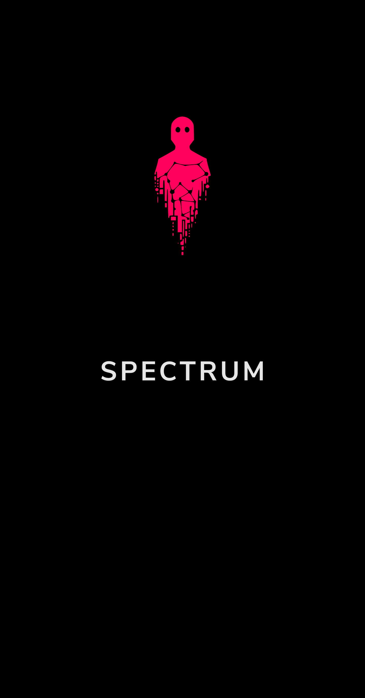
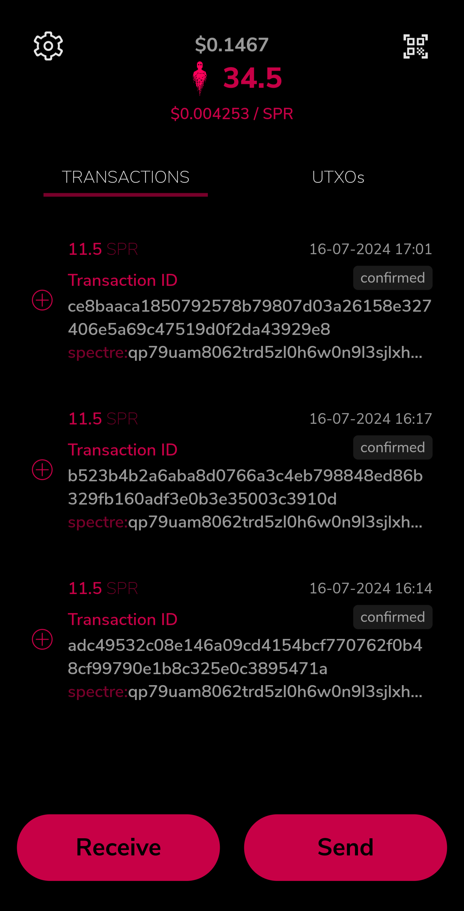
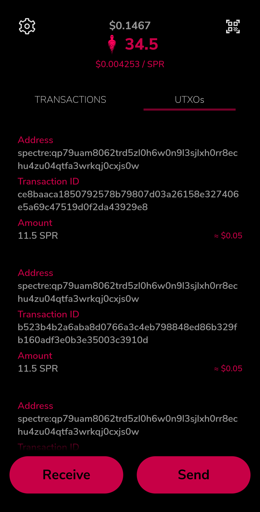
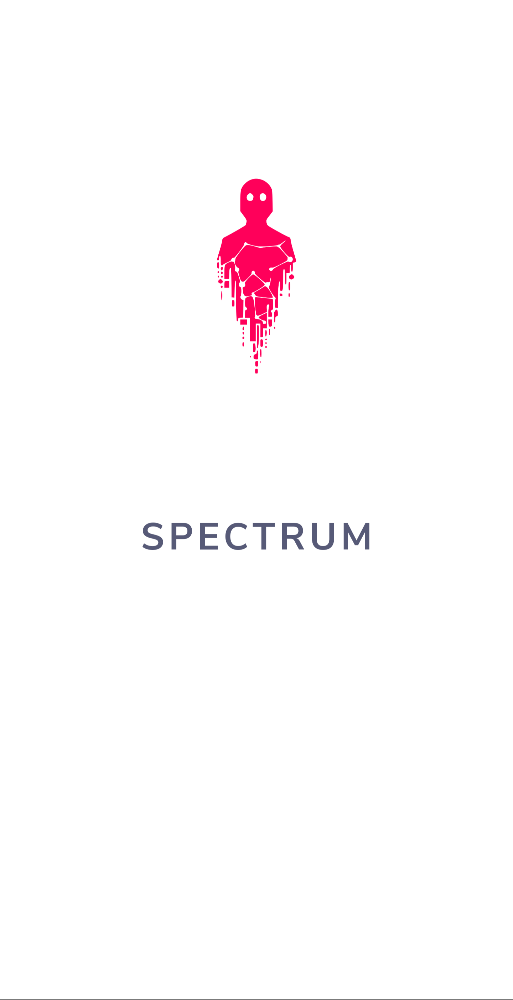
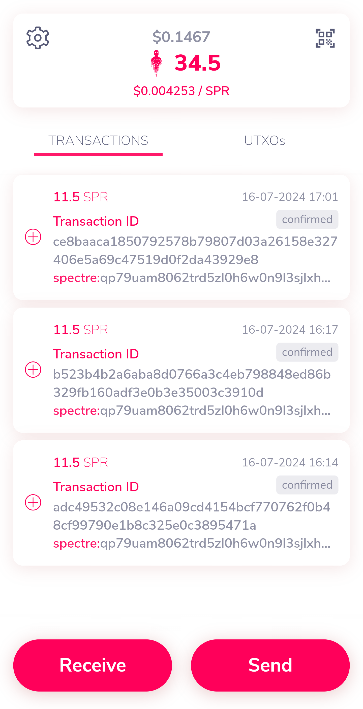
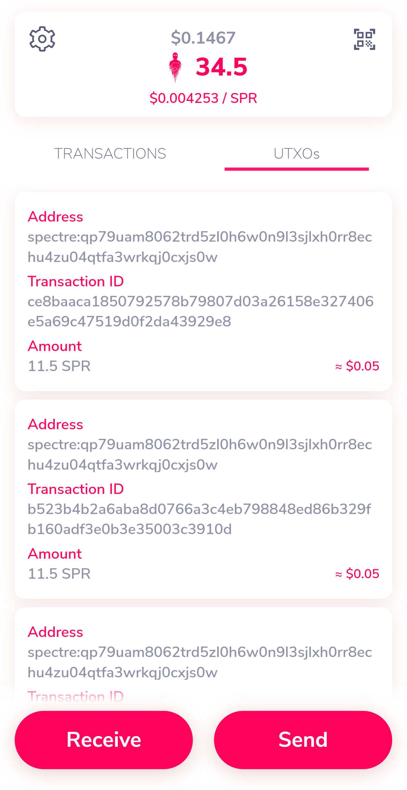
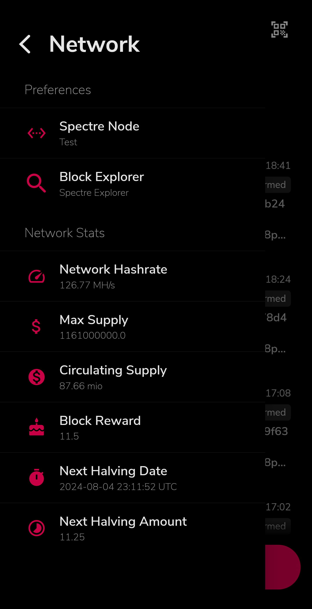
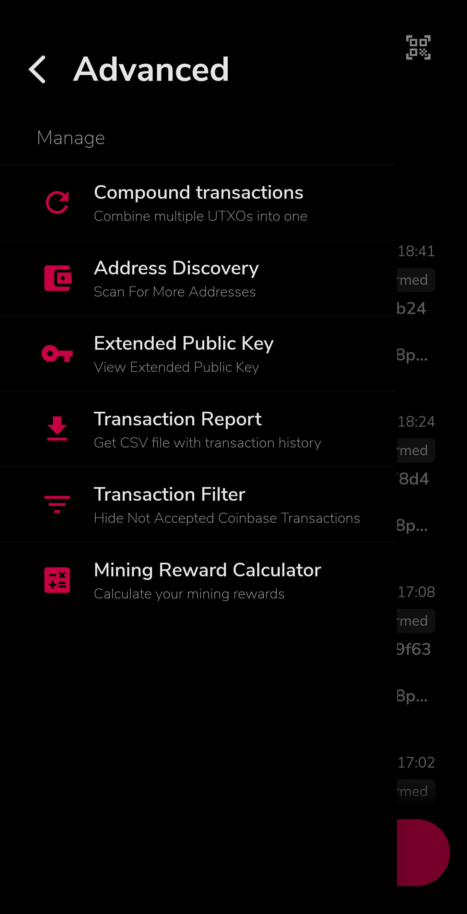
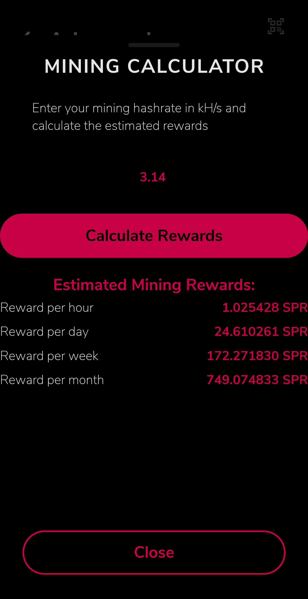

## What is Spectrum?

[](https://github.com/spectre-project/spectre-mobile/releases)
[](https://github.com/spectre-project/spectre-mobile/blob/main/LICENSE)
[](https://github.com/spectre-project/spectre-mobile/releases/latest)
[](https://discord.com/invite/FZPYpwszcF)

Spectrum is a non-custodial wallet for the [Spectre Network](https://spectre-network.org/)
BlockDAG, available for Android and iOS. It is written in
[Dart](https://dart.dev) using [Flutter](https://flutter.dev).

## Features

* **Wallet Import:** Import 12 and 24-word wallets.
* **Real-Time Network Stats:** Monitor network statistics directly from the network menu.
* **Mining Reward Calculator:** Access a mining reward calculator in the advanced menu.
* **CSV Export:** Export your transactions as CSV files from the advanced menu.
* **Theme Options:** Choose between Light, Dark, and AMOLED Dark themes.

## Contributing

* Fork the repository and clone it to your local machine
* Follow the instructions [here](https://flutter.io/docs/get-started/install) to install the Flutter SDK
* Setup [Android Studio](https://flutter.io/docs/development/tools/android-studio) or [Visual Studio Code](https://flutter.io/docs/development/tools/vs-code).

## Building

### Android:
To build the APK for Android, use the following command:
```bash
flutter build apk
```
This command compiles the app into a single universal APK compatible with all device architectures.

For generating APKs for specific device architectures, use:
```bash
flutter build apk --split-per-abi
```
This will create separate APKs for different ABIs (Application Binary Interfaces), allowing users to download only the APK suitable for their device, reducing the overall download size.

### iOS:
To build the app for iOS, use:
```bash
flutter build ios
```
This command compiles the app for iOS devices.

### Running the App:
If you have a connected device or emulator, you can run the app directly from your development machine.

#### Debug Mode:
To run the app in debug mode, use:
```bash
flutter run
```
This mode is useful for development and testing, providing hot reload and detailed error messages.

#### Release Mode:
To run the app in release mode, use:
```bash
flutter run --release
```

## Translations

For some details regarding translations, have a look at
[Translations and translators](./TRANSLATORS.md).

## Have a question?

If you need any help, feel free to [file a feature request or an issue](https://github.com/spectre-project/spectre-mobile/issues) if you do not manage to find a solution.

## Screenshots

|  |  |  |
|---------------------------|---------------------------|---------------------------|
|  |  |  |
|  |  |  |

## License

All code is copyrighted by the Kaspium Wallet authors and the Spectre Network
developers under the MIT license.
